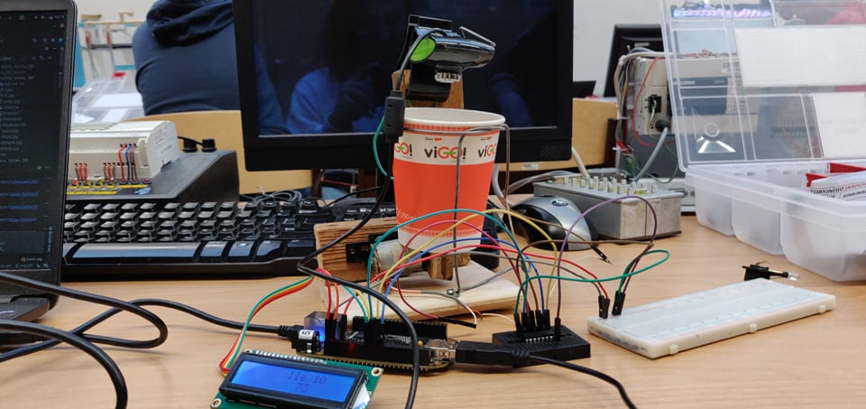
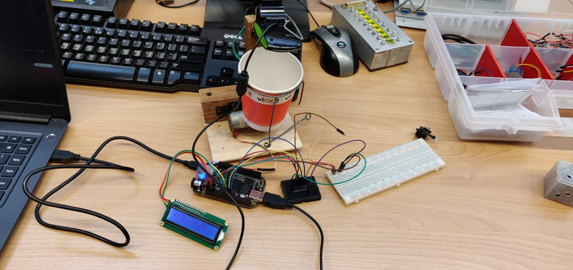
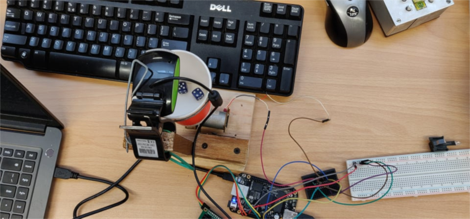

# Embedded system project - Random number generator V2

## Table of contents
* [General info](#General-info)
* [Schematic](#Schematic)
* [How it works](#How-it-works)
* [Technologies](#technologies)


## General info
Truly random number generator based on counting dots on two dices, which added together served as a seed for python random library.
Image recognition was performed with use of OpenCV libary on BeaglboneBlack platform






## Schematic
*Led was meant to substitue flashlight, which we didn't use after all. L298n was replaced with L298d*


## How it works
App offers 2 different seed choice methods:
- run engine to roll the dice and treat sum of dots as seed
- sum N last results from database stored locally(sqlite3)

After that, app returns random number from desired range both to the terminal and LCD display

To count dots, app uses OpenCV library:

```python
def countDots():
    sleep(1)
    camera = cv2.VideoCapture(0)
    _, img = camera.read()
    gray = cv2.cvtColor(img,cv2.COLOR_BGR2GRAY)
    circles = cv2.HoughCircles(gray, cv2.HOUGH_GRADIENT, 1, minDist=13, param1=160, param2=11,
                               minRadius=5, maxRadius=10)
    if circles is not None:
        circles = np.uint16(np.around(circles))
        return len(circles[0])
```
sleep(1) was meant to prevent capturing photo when dices were still moving

*Example of dots counting from notebook.ipynb file*


## Technologies
- Python3
- OpenCV
- Adafruit_BBIO
- python-liquidcrystal-i2c from github

Hardware platform in this projects was BeagleBone Black


